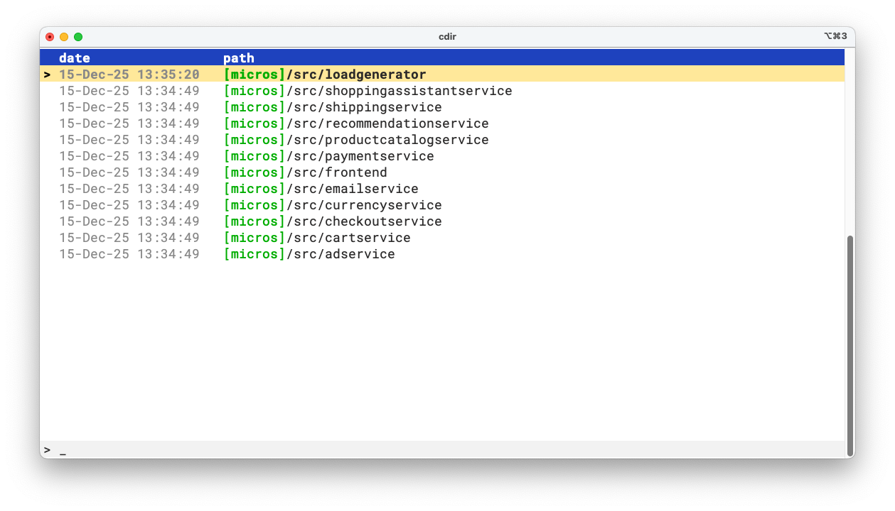
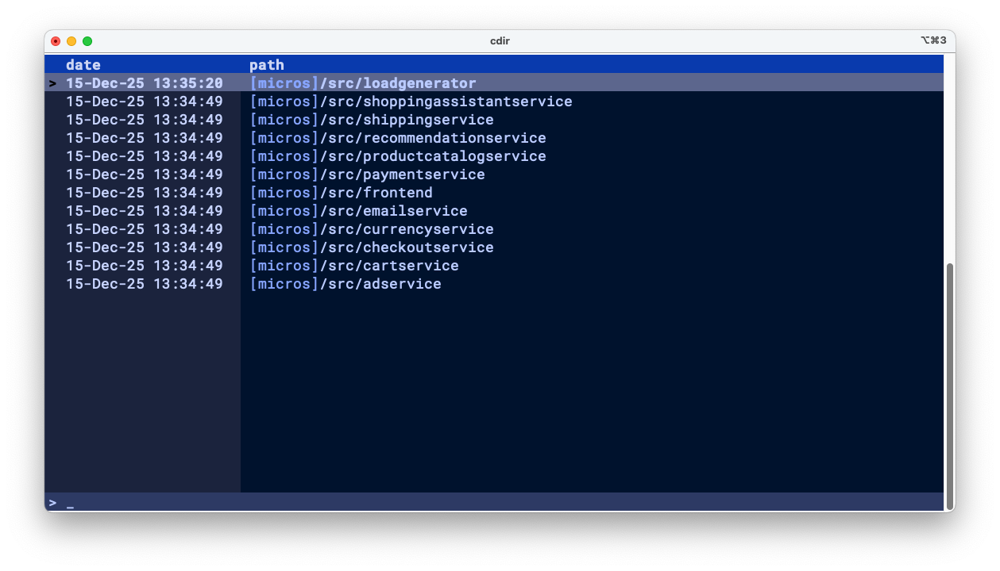
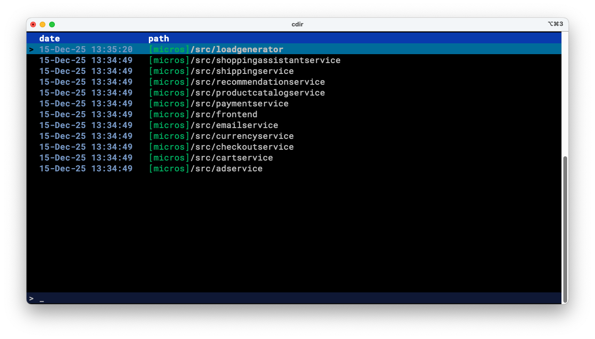
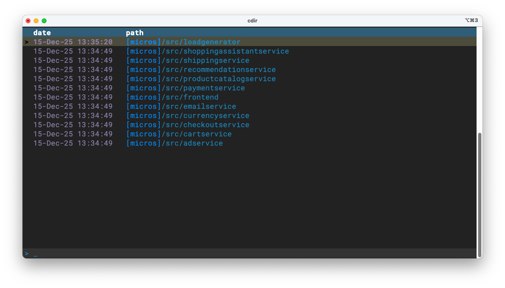
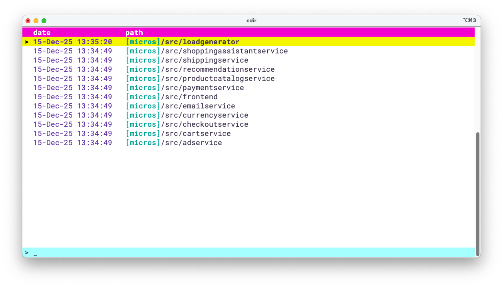
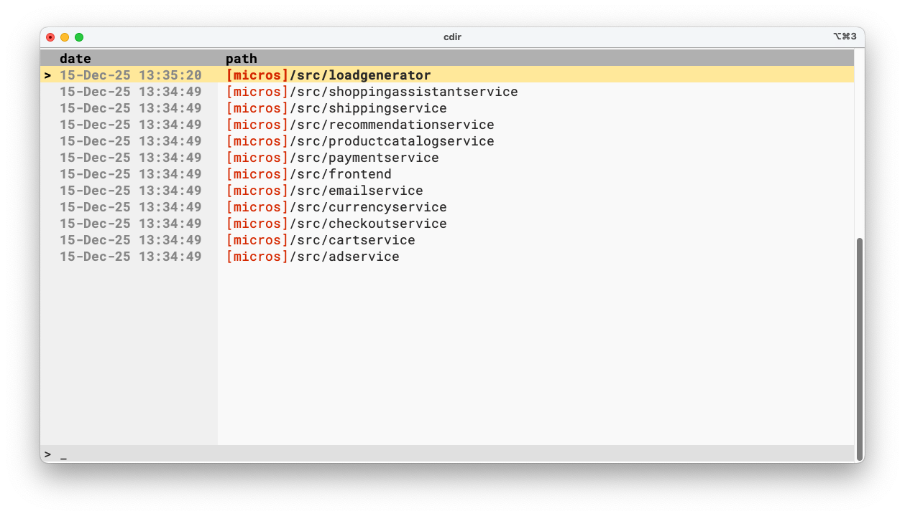

# Configuration

You can customize many aspects of `cdir` to fit your needs.

To find the configuration file path, run:

```
$ cdir config-file
/path/to/the/configuration/file
```

Edit this file to adjust your settings as described below:

## Themes and colors

### Selecting a theme

The most simple way to change the colors is to select a _theme_.
It is done by setting the option `theme` into the configuration file, e.g.:

```
theme: default
```

Several themes are provided by default:

* _default_



* _dark-blue_



* _dark_



* _winter_



* _light-autumn_


* _light-joy_



* _pure_




When no theme is explicitly set, the _default_ theme is implicitly selected.

### Creating a new theme

Themes are defined in files located into the `themes` directory which is in the configuration file directory.

The file name is `<theme_name>.yml`.
For instance, you can find the definition of the _default_ theme in the file `themes/default.yml`. 

The several colors and text styles that can be defined inside a theme file are:

* `title`: the text color of windows title

* `background`: the background color of the UI, if not set, the terminal background color is used

* `border`: the border color of windows

* `text`: regular text color

* `text_em`: emphasized text color

* `date`: the date color in the directory history view

* `path`: the directory path color

* `highlight`: the highlight color for selection

* `shortcut_name`: the shortcut name color

* `header_fg`: the header foreground color

* `header_bg`: the header background color

* `description`: the shortcut description color

* `free_text_area_bg`: the free text area (at the bottom of the list)

* `home_tilde`: color of the `~` for the home directory

* `title`: text color of the window title
* `title_bold`: whether the window title is bold
* `title_italic`: whether the window title is italic

* `background`: background color of the UI (if not set, terminal background is used)
* `left_background`: background color of the left panel
* `border`: border color of windows

* `text`: regular text color
* `text_bold`: whether regular text is bold
* `text_italic`: whether regular text is italic

* `text_em`: emphasized text color
* `text_em_bold`: whether emphasized text is bold
* `text_em_italic`: whether emphasized text is italic

* `date`: date color in the directory history view
* `date_bold`: whether date text is bold
* `date_italic`: whether date text is italic

* `path`: directory path color
* `path_bold`: whether path text is bold
* `path_italic`: whether path text is italic

* `highlight`: highlight color for selection

* `shortcut_name`: shortcut name color
* `shortcut_name_bold`: whether shortcut name is bold
* `shortcut_name_italic`: whether shortcut name is italic

* `header_fg`: header foreground color
* `header_bg`: header background color

* `description`: shortcut description color
* `description_bold`: whether description is bold
* `description_italic`: whether description is italic

* `free_text_area_bg`: background color of the free text area (at the bottom of the list)

* `home_tilde`: color of the `~` for the home directory
* `home_tilde_bold`: whether the home tilde is bold
* `home_tilde_italic`: whether the home tilde is italic

For instance, the default theme is:
```yaml
title: "#1d5cba"
background: "#ffffff"
border: "#cccccc"
text: "#2a2a2a"
text_em: "#009dc8"
date: "#888888"
path: "#2a2929"
highlight: "#fbe9a4"
shortcut_name: "#00aa00"
header_fg: "#ffffff"
header_bg: "#2741b7"
description: "#808080"
free_text_area_bg: "#f2f2f2"
home_tilde: "#888888"
```
### Overriding a theme parameter

The colors and styles used by a theme can be overriden.
To do so, in the configuration file, on top of selecting a theme you can specify the parameter(s) that you want to change into the `inline_theme` option, e.g.:

```yaml
inline_theme:
  background: "#d9d9d9ff"
  ...
```

All the parameters available to define a theme can be overriden.

### Dark/light mode

`cdir` can detect whether the current system (macOS/Linux) theme is dark or light and adjust its current theme accordingly.

In order to use this feature, you must define the `theme_dark` and `theme_light` parameters in you configuration:

* When a system dark theme is detected, `cdir` will select the theme indicated into `theme_dark`;

* When a system light theme is detected, `cdir` will select the theme indicated into `theme_light`;

* If the system theme type cannot be detected, `cdir` will fallback to the theme indicated into `theme`.

Example:
```yaml
theme: default
theme_light: default
theme_dark: dark-blue
```

Then, in a similar way, the dark and light theme colors and styles can be specifically overriden using the parameter `inline_theme_dark` and `inline_theme_light`.


## Date format

The date format can be customized using the `date_format` option in the configuration file.
Refer to the [chrono docs](https://docs.rs/chrono/0.4.38/chrono/format/strftime/index.html) for the formating
options.


```yaml
date_format: "%d-%b-%y %H:%M"
```

## Path to the database file

You can configure where the database file (that contains the data stored by `cdir`) is located.
Most of the time, you don't need to change this configuration.


The path to the database can be set using the `db_path` option in the configuration file.
Note that it should include the filename, for instance:

```yaml
db_path: "/home/user/.local/share/cdir/development.db"
```

!!! warning
    If you change the path to the database file, you need to copy the existing database file to the new path.
    If you don't do this, you will no more see the previous history into `cdir`.

## Path to the log configuration file

This configuration controls where `cdir` is taking its configuration file for logging.
Most of the time, you don't need to change this configuration.

The option is: `log_config_path`.

By default, cdir logs are configured in a `log4rs.yaml` file in the config directory.


## The log configuration file

`cdir` uses [log4rs](https://docs.rs/log4rs/latest/log4rs/index.html) to log.
The reference document for its is configuration is [here](https://docs.rs/log4rs/latest/log4rs/config/index.html#configuration).

The default configuration is setup to rotate log files ensuring the space taken on the drive is limited.

The logging level can be adjusted to `DEBUG` or `TRACE` for investigation when a bug is found.
