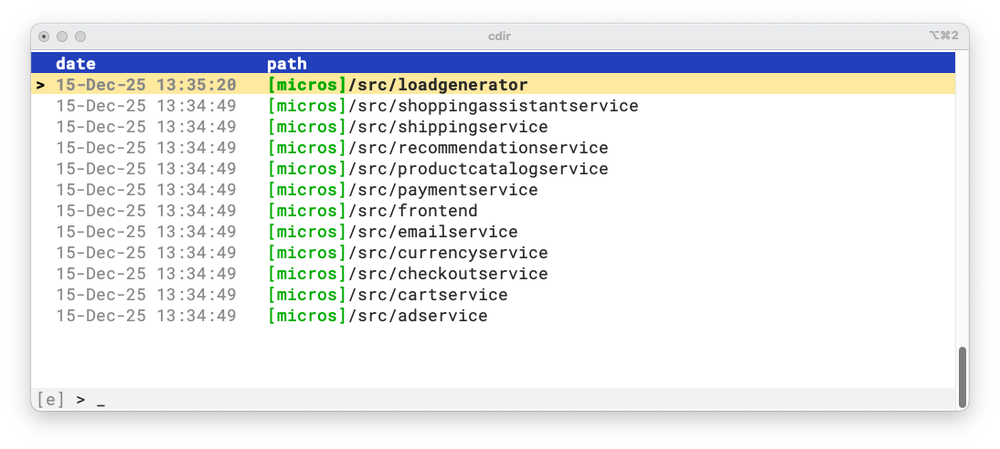

# The Graphical User Interface

The GUI can be launched with the `c` command.

## Main views

### Directory history view

Below is the *Directory history view*, the default screen when you launch the GUI:



On the left, you'll see the date of your last visit to each directory. The corresponding directory path appears on the right.

At the bottom, there's a search bar where you can type to filter results. The indicator on the left shows `[e]` for exact match mode, or `[f]` for fuzzy search mode.

### Shortcuts view

Here is the *Shortcuts view*:


A shortcut is a directory path that you assign a name to, with an optional description.

For example, the shortcut `micros` points to `~/microservices-demo/`, and `fe` points to `~/microservices-demo/src/frontend`.
When displaying the `fe` path, the GUI uses the `micros` shortcut for its parent, showing it as `[micros]/src/frontend`.

The search bar is also present at the bottom.

## Actions

You can open the UI by typing ```c``` in your terminal.

There are three main views:

1. *Directory history view*: List of previously visited directories, sorted by most recent visit, with last visit date.

1. *Shortcuts view*: List of defined shortcuts.

1. *Help view*: Shows available commands.

Use <kbd>Tab</kbd> to switch between the first two views, and <kbd>Ctrl+H</kbd> for help.

* <kbd>Enter</kbd>: Go to selected directory

* <kbd>Esc</kbd> or <kbd>Ctrl+q</kbd>: Exit and stay in the current directory

* <kbd>Up/Down</kbd>: Select directory (<kbd>Shift</kbd> for bigger jumps)

* <kbd>Page Up/Page Down</kbd>: Scroll by page

* <kbd>Home</kbd>: Go to most recent directory (the top)

* <kbd>Ctrl+a</kbd>: Show full directory path (the full path is shown instead of the shortcut names), or switch back to shortcut usage.

* <kbd>Ctrl+d</kbd>: Delete selected entry

* <kbd>Ctrl+e</kbd> (shortcuts view): Edit description

* <kbd>Ctrl+f</kbd> Switch between exact and fuzzy search

Also, you can simply type a string to filter directories history or shortcuts.

## Search

### Exact match

The search text will be used to search an exact substring match into the directory path.

Concerning the shortcuts, the name and description are also searched.

In the *Directory history view*, the directories remains ordered by date with the most recents first.

And, in the *Shortcuts view*, the orders remains by shortcut name.

### Fuzzy

In the `fuzzy` mode, you can search for instance with several keyworks e.g. `foo bar`.

You can also specify that you want to search for a word at the beginning e.g. `^/etc`, or at the end e.g. `src$`.
You can also reverse the search with ! e.g. `!src$`.

In both the *Directory history* view and in the *Shortcuts view*, the directories are ordered by best match.

## Smart suggestions (experimental)

When activated, the smart suggestions feature suggsts directories based on your current directory, recent activity, and frequency of visits.

They appear at the top of the *Directory history view* when you open the GUI.
They are recognizable by the `@` character on the left side in place of the date.

You can enable or disable this feature in the configuration file.

!!! info
    This feature is based on your history of visited directories.
    If you have just started using `cdir` or just installed the release implementing it, or calling `cdir` from a
    directory you have never visited before, no recommendation will be shown.